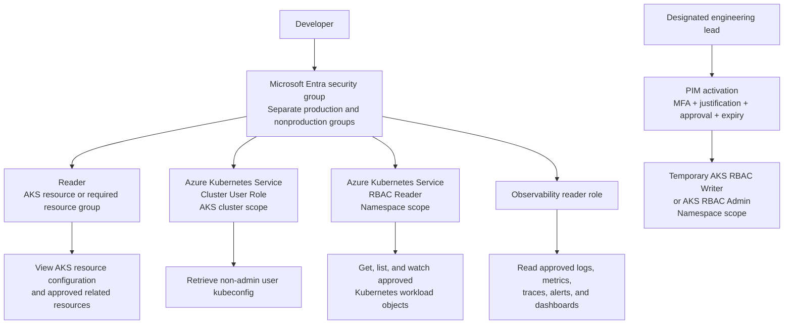

# Least-Privilege AKS Workload Access

Practical guidance for granting application teams enough access to inspect and troubleshoot Azure Kubernetes Service (AKS) workloads without broad production administration.

## Access Challenge

Container application teams need sufficient visibility into the AKS workloads they deploy, including through the Azure portal where required, without receiving broad production administration. The target state enables teams to independently diagnose routine release and workload issues while preserving least privilege, namespace isolation, and auditable elevation.

## Recommendation

Use separate Microsoft Entra security groups for production and nonproduction. Grant the standing production reader group:

1. **Reader** at the AKS resource or required resource-group scope.
2. **Azure Kubernetes Service Cluster User Role** at the AKS cluster scope.
3. **Azure Kubernetes Service RBAC Reader** at the supported namespace scope.

Grant observability access separately. Use Microsoft Entra Privileged Identity Management (PIM) for time-limited **Azure Kubernetes Service RBAC Writer** or **Azure Kubernetes Service RBAC Admin** access when designated engineering leads must perform approved changes.

Do not grant standing Contributor, cluster-admin, node access, Secret access, or AKS Run Command solely to enable workload visibility.



## Role Model

| Assignment | Scope | Purpose | Boundary |
|------------|-------|---------|----------|
| **Reader** | AKS resource or required resource group | View Azure Resource Manager configuration and status | Does not authorize Kubernetes objects or retrieve kubeconfig |
| **Azure Kubernetes Service Cluster User Role** | AKS cluster | Retrieve a user kubeconfig | Does not authorize Pods, Deployments, or other Kubernetes objects |
| **Azure Kubernetes Service RBAC Reader** | Supported namespace | Read most workload objects, status, Events, and Services | Excludes Secrets, RBAC objects, and writes |
| **Observability reader** | Approved monitoring resources | Read approved metrics, logs, traces, alerts, and dashboards | Product-specific and separate from AKS authorization |
| **Azure Kubernetes Service RBAC Writer** through PIM | Supported namespace | Perform approved workload changes temporarily | Can access Secrets and run Pods as service accounts |
| **Azure Kubernetes Service RBAC Admin** through PIM | Supported namespace | Perform approved namespace administration temporarily | Can administer most namespace resources and namespace RBAC |

## Prerequisites

Confirm the target cluster:

- Uses managed Microsoft Entra integration.
- Uses Microsoft Entra authorization/Azure RBAC for the Kubernetes API.
- Has a defined production namespace ownership model.
- Is reachable from the developers' normal network path.
- Has approved log and observability data-classification controls.
- Has PIM configured if temporary elevation is required.

Inspect the cluster:

```powershell
$SubscriptionId = "<subscription-id>"
$ResourceGroup = "<resource-group>"
$ClusterName = "<aks-cluster>"

az account set --subscription $SubscriptionId

az aks show `
  --resource-group $ResourceGroup `
  --name $ClusterName `
  --query '{id:id,privateCluster:apiServerAccessProfile.enablePrivateCluster,authorizedIpRanges:apiServerAccessProfile.authorizedIpRanges,aadManaged:aadProfile.managed,azureRbac:aadProfile.enableAzureRbac,localAccountsDisabled:disableLocalAccounts}' `
  --output json
```

For an existing AKS Standard cluster that has not yet enabled the required identity model, treat the following as a reviewed configuration change:

```powershell
az aks update `
  --resource-group $ResourceGroup `
  --name $ClusterName `
  --enable-aad `
  --enable-azure-rbac
```

Validate application compatibility, administrator access, automation identities, existing Kubernetes RBAC bindings, and rollback requirements before changing a production cluster's authorization model.

## Entra Group Design

Use groups rather than direct user assignments.

Example naming:

```text
cust-aks-<application>-nonprod-reader
cust-aks-<application>-prod-reader
cust-aks-<application>-prod-writer-eligible
cust-aks-<application>-prod-admin-eligible
cust-aks-platform-approvers
```

Avoid a single global AKS group spanning unrelated production applications or clusters.

## Standing Reader Implementation

Set the target values:

```powershell
$ResourceGroup = "<resource-group>"
$ClusterName = "<aks-cluster>"
$Namespace = "<application-namespace>"
$ReaderGroupObjectId = "<entra-reader-group-object-id>"

$AksId = az aks show `
  --resource-group $ResourceGroup `
  --name $ClusterName `
  --query id `
  --output tsv
```

Grant Azure resource visibility:

```powershell
az role assignment create `
  --assignee-object-id $ReaderGroupObjectId `
  --assignee-principal-type Group `
  --role "Reader" `
  --scope $AksId
```

If the portal experience requires visibility into supporting resources, grant Reader only at the narrowest additional scopes required. Do not default to subscription scope.

Grant user kubeconfig retrieval:

```powershell
az role assignment create `
  --assignee-object-id $ReaderGroupObjectId `
  --assignee-principal-type Group `
  --role "Azure Kubernetes Service Cluster User Role" `
  --scope $AksId
```

Grant namespace-scoped Kubernetes read access:

```powershell
az role assignment create `
  --assignee-object-id $ReaderGroupObjectId `
  --assignee-principal-type Group `
  --role "Azure Kubernetes Service RBAC Reader" `
  --scope "$AksId/namespaces/$Namespace"
```

Role assignments can require several minutes to propagate.

List namespace-scoped assignments:

```powershell
az role assignment list `
  --scope "$AksId/namespaces/$Namespace" `
  --output table
```

Namespace-scoped assignments might not appear at the expected scope in the Azure portal. Use Azure CLI to verify them.

## Developer Connection

The developer signs in using their individual Entra identity:

```powershell
az login --tenant "<tenant-id>"
az account set --subscription "<subscription-id>"

az aks get-credentials `
  --resource-group "<resource-group>" `
  --name "<aks-cluster>" `
  --overwrite-existing

kubelogin convert-kubeconfig -l azurecli
kubectl auth whoami
```

Do not distribute shared local or administrator kubeconfig files.

## Validation

Validate with a nonprivileged user who is only a member of the proposed reader group.

### Expected to succeed

```powershell
kubectl auth can-i get pods --namespace $Namespace
kubectl auth can-i list deployments.apps --namespace $Namespace

kubectl get deployments --namespace $Namespace
kubectl get pods --namespace $Namespace
kubectl get events --namespace $Namespace
kubectl get services --namespace $Namespace
```

Validate logs only if approved:

```powershell
kubectl logs <pod-name> --namespace $Namespace
kubectl logs <pod-name> --namespace $Namespace --previous
```

### Expected to be denied

```powershell
kubectl auth can-i get secrets --namespace $Namespace
kubectl auth can-i create deployments.apps --namespace $Namespace
kubectl auth can-i patch deployments.apps --namespace $Namespace
kubectl auth can-i delete pods --namespace $Namespace
kubectl auth can-i create pods/exec --namespace $Namespace
kubectl auth can-i create pods/portforward --namespace $Namespace
kubectl auth can-i get pods --namespace "<unassigned-namespace>"
```

Do not perform destructive validation against production objects. Use `kubectl auth can-i` and a dedicated nonproduction workload for write-path tests.

## Azure Portal and Network Validation

For Azure portal workload views to function, all of the following must be valid:

1. The user can view the AKS Azure resource.
2. The user can retrieve or use an approved user context.
3. The user has Kubernetes authorization for the requested namespace and objects.
4. The browser or workstation can reach the Kubernetes API.
5. Private DNS, VPN, routing, firewall, proxy, or authorized IP restrictions permit access.

Do not respond to a portal authorization or connectivity error by immediately granting Contributor or cluster-admin. Identify the failing layer first.

## PIM Elevation

Use PIM only for designated leads who need to execute approved changes.

Recommended controls:

- MFA
- Business justification
- Incident or change-ticket reference
- Independent approver
- Short activation duration
- Notification to platform/security owners
- Automatic expiry
- Regular access review

Prefer namespace scope. Use Writer only after accepting its Secret and service-account implications. Use Admin only when namespace RBAC administration is required.

## Operational Permission Boundary

### Standing reader access

- Workload status
- Deployments and ReplicaSets
- Pods and restart state
- Kubernetes Events
- Services and ingress status
- Approved logs
- Approved observability dashboards

### Temporary approved elevation

- Workload patching
- Scaling
- Rollout restart or rollback
- Other documented namespace operations

### Retain with platform or production operations

- Cluster-wide administration
- Node access
- Node-pool and network changes
- API server changes
- AKS Run Command
- Secret administration
- RBAC administration outside approved namespace scope

## Rollout

1. Inventory current cluster authorization, role assignments, bindings, network controls, and local accounts.
2. Define application, environment, namespace, and support ownership.
3. Pilot one nonproduction namespace with a dedicated Entra group.
4. Execute positive and negative tests.
5. Validate the portal and normal developer network path.
6. Configure and test PIM elevation if required.
7. Obtain security and production-operations approval.
8. Roll out to one production namespace and a limited cohort.
9. Review access and audit evidence regularly.
10. Remove superseded broad or shared access after validation.

## References

- [AKS access and identity options](https://learn.microsoft.com/en-us/azure/aks/concepts-identity)
- [AKS cluster authorization concepts](https://learn.microsoft.com/en-us/azure/aks/concepts-cluster-authorization)
- [Microsoft Entra authorization for the Kubernetes API](https://learn.microsoft.com/en-us/azure/aks/entra-id-authorization)
- [Access Kubernetes resources using the Azure portal](https://learn.microsoft.com/en-us/azure/aks/kubernetes-portal)
- [AKS built-in Azure roles](https://learn.microsoft.com/en-us/azure/role-based-access-control/built-in-roles/containers)
- [PIM for AKS cluster and node access](https://learn.microsoft.com/en-us/azure/aks/privileged-identity-management)
- [Azure RBAC best practices](https://learn.microsoft.com/en-us/azure/role-based-access-control/best-practices)
